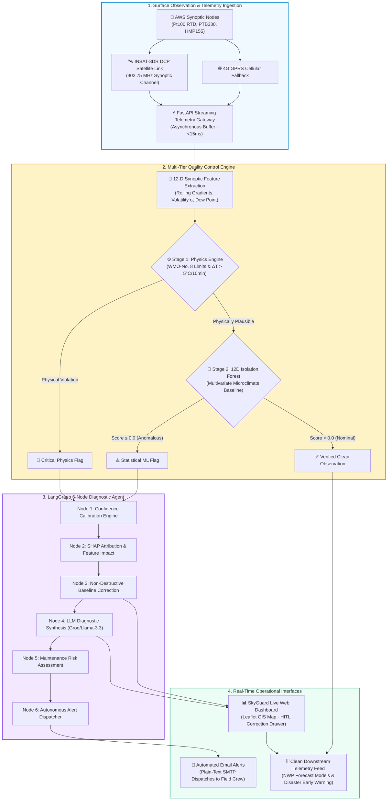
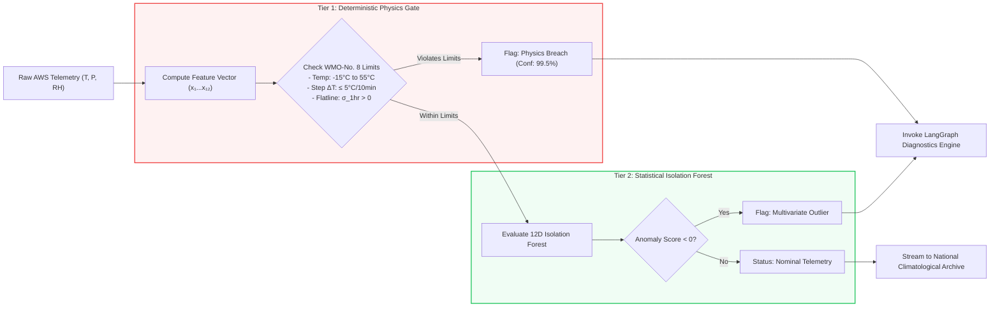
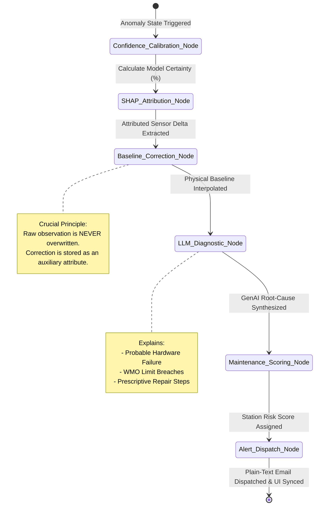
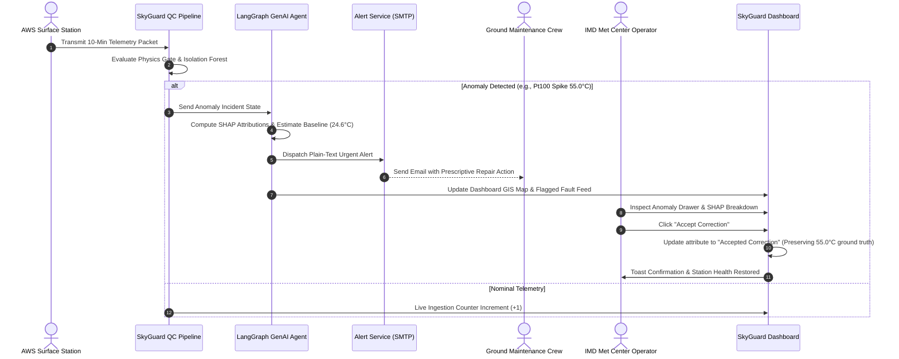

# 🛰️ SkyGuard AI — Master Context, Flowcharts & PPT Presentation Dossier

**Smart India Hackathon 2026** | **Problem Statement ID:** 26073  
**Ministry / Organization:** Ministry of Earth Sciences (MoES) / India Meteorological Department (IMD)  
**Project Title:** SkyGuard AI — Real-Time Automatic Weather Station (AWS) Quality Control, Isolation Forest ML & LangGraph GenAI Diagnostics

---

## 📋 Table of Contents
1. [Executive Summary & 30-Second Elevator Pitch](#1-executive-summary--30-second-elevator-pitch)
2. [Copy-Pasteable Mermaid Flowcharts & Architecture Diagrams](#2-copy-pasteable-mermaid-flowcharts--architecture-diagrams)
   - [Diagram A: Complete End-to-End System Architecture](#diagram-a-complete-end-to-end-system-architecture)
   - [Diagram B: Two-Tier Anomaly Detection Flow (Physics + ML)](#diagram-b-two-tier-anomaly-detection-flow-physics--ml)
   - [Diagram C: LangGraph 6-Node Diagnostic State Machine](#diagram-c-langgraph-6-node-diagnostic-state-machine)
   - [Diagram D: Human-in-the-Loop (HITL) Quality Control Loop](#diagram-d-human-in-the-loop-hitl-quality-control-loop)
3. [Slide-by-Slide PowerPoint Content & Card Layout](#3-slide-by-slide-powerpoint-content--card-layout)
   - [Slide 1: Idea / Solution Overview & Problem Cards](#slide-1-idea--solution-overview--problem-cards)
   - [Slide 2: Technical Approach & Architecture](#slide-2-technical-approach--architecture)
   - [Slide 3: Feasibility & Operational Viability](#slide-3-feasibility--operational-viability)
   - [Slide 4: Impact, Benefits & ROI](#slide-4-impact-benefits--roi)
   - [Slide 5: Research, WMO Standards & Citations](#slide-5-research-wmo-standards--citations)
   - [Slide 6: Live Prototype Demonstration & Verification](#slide-6-live-prototype-demonstration--verification)
4. [Mathematical Formulations & Physics Guardrails](#4-mathematical-formulations--physics-guardrails)
5. [Sensor Hardware & Meteorological Failure Modes](#5-sensor-hardware--meteorological-failure-modes)
6. [Top 10 SIH Judge Q&A Defense Guide](#6-top-10-sih-judge-qa-defense-guide)

---

# 1. Executive Summary & 30-Second Elevator Pitch

### **The Problem:**
India's network of thousands of Automatic Weather Stations (AWS) transmits continuous surface telemetry over INSAT-3DR satellite links. In harsh field environments, sensors frequently suffer from electrical spikes, dust-clogged tipping buckets, and calibration drifts. Traditional threshold rules trigger excessive false alarms during genuine storms, while basic ML models only output black-box flags without explaining *why* a sensor failed or *which* hardware component requires replacement.

### **The SkyGuard AI Solution:**
SkyGuard AI is a multi-tier meteorological quality control and agentic diagnostic platform. It couples **WMO-No. 8 thermodynamic physical constraints** with an unsupervised **12-Dimensional Isolation Forest** to detect anomalies in under 15 milliseconds. When a fault is detected, a **6-node LangGraph agentic workflow** calculates SHAP feature attributions, interpolates non-destructive baseline corrections (preserving raw telemetry as ground truth), synthesizes natural language root-cause diagnostics, and autonomously dispatches real-time alerts to ground maintenance technicians.

---

# 2. Copy-Pasteable Mermaid Flowcharts & Architecture Diagrams

*(You can copy any of these Mermaid code blocks into [mermaid.live](https://mermaid.live), Draw.io, Eraser.io, or PowerPoint Mermaid plugins).*

---

### **Diagram A: Complete End-to-End System Architecture**

---

### **Diagram B: Two-Tier Anomaly Detection Flow (Physics + ML)**

---

### **Diagram C: LangGraph 6-Node Diagnostic State Machine**

---

### **Diagram D: Human-in-the-Loop (HITL) Quality Control Loop**

---

# 3. Slide-by-Slide PowerPoint Content & Card Layout

---

## 📌 SLIDE 1: Idea & Proposed Solution

### **Header:**
* **Title:** `SKYGUARD AI`
* **Subtitle:** `Real-Time Quality Control & Agentic GenAI Diagnostics for Automatic Weather Station Networks`
* **Badge:** `SIH 2026 | Problem Statement 26073 | Ministry of Earth Sciences (IMD)`

---

### **Slide 1 Layout (4 Grid Cards):**

#### 🟥 **Card 1: The Problem (Challenges in AWS Monitoring)**
* **Extreme Field Exposure:** Thousands of remote AWS units suffer from sensor spikes, solar radiation heating, dust clogging, and battery dropouts.
* **Flawed Rule Filters:** Static threshold filters fail to catch subtle calibration drifts and generate massive false alarm storms during genuine weather fronts.
* **Unexplained Black-Box Flags:** Existing ML algorithms output basic `True/False` flags without pinpointing *which* sensor failed or *why*.
* **Downstream Model Pollution:** Corrupted ground telemetry enters Numerical Weather Prediction (NWP) and disaster early warning models.

#### 🟦 **Card 2: The Proposed Solution (SkyGuard AI Architecture)**
* **Real-Time Telemetry Streaming:** Continuous ingestion of multi-parameter readings ($T, P, RH, \text{Wind}$) from AWS networks.
* **Two-Tier Hybrid Detection:** Pairs deterministic thermodynamic limits ($\Delta T > 5^\circ\text{C}/10\text{min}$) with an unsupervised 12-D Isolation Forest.
* **6-Node LangGraph Agent:** Computes SHAP explainability, calculates temporal baseline corrections, and synthesizes root-cause diagnostics.
* **Non-Destructive Correction:** Preserves raw observations as permanent ground truth while providing validated baseline attributes.
* **Autonomous Plain-Text Alerts:** Instant email notifications dispatched directly to maintenance crews with prescriptive repair steps.

#### 🟨 **Card 3: Why SkyGuard AI is Different (Key USPs)**
* **Physics-Coupled Validation:** Validates cross-sensor atmospheric consistency (e.g., temperature vs pressure vs dew point) to avoid false alarms during genuine storms.
* **SHAP Mathematical Explainability:** Quantifies exact mathematical feature contributions driving every anomaly detection.
* **Prescriptive Field Guidance:** Eliminates guess-work by telling field technicians exactly what to inspect (e.g., RTD wiring vs transducer membrane).

#### 🟩 **Card 4: Expected Value & Impact**
* **99%+ Meteorological Data Trust:** Clean, verified telemetry for disaster management and climate research.
* **60% Reduction in Station Downtime (MTTR):** Faster technician response with automated root-cause isolation.
* **Zero Infrastructure Lock-In:** Ultra-fast (<15ms per station) processing executable on cloud servers or low-cost edge loggers.

---

## 📌 SLIDE 2: Technical Approach & Architecture

### **Left Column: Technical Flow & Data Pipeline**
1. **Telemetry Ingestion Layer:** Ingests 10-minute DCP bursts over INSAT-3DR (402.75 MHz) and 4G GPRS.
2. **Feature Engineering (12-D Vector):**
   * Instantaneous readings: $T, P, RH$
   * Rolling rates of change: $\Delta T_{10\text{min}}, \Delta P_{10\text{min}}, \Delta RH_{10\text{min}}$
   * 1-Hour Rolling Volatility: $\sigma(T), \sigma(P), \sigma(RH)$
   * Atmospheric relations: Dew point depression $(T - T_d)$, diurnal cyclical components ($\sin(\text{hour}), \cos(\text{hour})$).
3. **Two-Tier Quality Control:**
   * *Tier 1 (Deterministic):* WMO-No. 8 physical limits and gradient constraints.
   * *Tier 2 (Statistical):* 12-Dimensional Isolation Forest scoring multivariate microclimates.
4. **Agentic Diagnostic State Machine:** 6-Node LangGraph workflow executes confidence calibration, SHAP calculation, temporal interpolation, GenAI diagnosis, and alert dispatch.
5. **Human-in-the-Loop (HITL) Dashboard:** Interactive React 19 GIS dashboard with 60-minute sliding window charts and 1-click correction validation.

### **Right Column: Technology Stack**
* **Core Machine Learning:** Python 3.10/3.12, Scikit-Learn (Isolation Forest), SHAP (TreeExplainer), NumPy, Pandas
* **Agentic Framework:** LangGraph, LangChain, Groq API (Llama-3.3-70B / GPT-OSS 120B)
* **Backend Gateway:** FastAPI, Uvicorn, Python `smtplib` / `email.mime`
* **Frontend Dashboard:** React 19, Vite, Tailwind CSS, Leaflet.js (GIS Radar), Recharts, Lucide Icons
* **Cloud & Serverless:** Netlify Edge Functions (`nodemailer`), GitHub Actions CI/CD

---

## 📌 SLIDE 3: Feasibility & Operational Viability

### **1. Computational & Edge Feasibility:**
* **Sub-15ms Latency:** The lightweight Isolation Forest and physics gate process observations in `< 15ms`, allowing a single server to handle 5,000+ AWS stations simultaneously.
* **Edge Logger Compatible:** Can be deployed on remote AWS data loggers (Raspberry Pi/Linux ARM loggers) for edge-side validation prior to satellite transmission.

### **2. Cost Efficiency & Open Standards:**
* **Zero Licensing Fees:** Built entirely on open-source frameworks (Python, Scikit-Learn, React, FastAPI).
* **Token-Optimized LLM Execution:** The LLM is only invoked when an anomaly is verified, consuming negligible API tokens.

### **3. Overcoming Meteorological Challenges:**
* **Regional Microclimate Adaptation:** Normalized against altitude lapse rates ($\approx 6.5^\circ\text{C}/1000\text{m}$) and regional clustering (coastal, arid, Himalayan) to prevent false spatial alarms.
* **Non-Destructive Audit Trail:** Complies with IMD data governance by keeping raw observation packets untouched in the permanent archive.

---

## 📌 SLIDE 4: Impact and Benefits

| Stakeholder | Key Benefit | Real-World Impact |
| :--- | :--- | :--- |
| **IMD Meteorologists** | Automated 24/7 Quality Control | Eliminates manual data scrubbing; ensures trusted inputs for weather models. |
| **Field Maintenance Crew** | Prescriptive Repair Alerts | Receives exact root cause (e.g., RTD lead fault) via plain-text email before visiting remote sites. |
| **Disaster Management (NDRF/SDMA)** | Early Warning Integrity | Prevents false alarms or missed cyclone/cloudburst signals due to sensor errors. |
| **Aviation & Agriculture** | Clean Microclimate Data | Guarantees precision weather data for flight planning and crop insurance claims. |

---

## 📌 SLIDE 5: Research, Standards & References

1. **World Meteorological Organization (WMO):** *Guide to Instruments and Methods of Observation (WMO-No. 8), Volume I — Measurement of Meteorological Variables.*
2. **India Meteorological Department (IMD):** *Standard Operating Procedures for AWS Network Management and Surface Telemetry Quality Assurance.*
3. **Empirical Baseline & Calibration Dataset:** *Historical Multi-Station Indian Surface Meteorological Observations Benchmark (Multi-Year Synoptic Weather Dataset via Kaggle / Open Data Repository).*
4. **Liu, F. T., Ting, K. M., & Zhou, Z. H. (2008):** *Isolation Forest.* IEEE International Conference on Data Mining (ICDM).
5. **Lundberg, S. M., & Lee, S. I. (2017):** *A Unified Approach to Interpreting Model Predictions (SHAP).* Neural Information Processing Systems (NeurIPS).
6. **LangGraph Multi-Agent Architecture (2024–2026):** *Stateful Cyclic Execution for Autonomous Diagnostic Systems.*

---

## 📌 SLIDE 6: Live Prototype Demonstration & Verification

* **Live Cloud Deployment URL:** [https://skyguard-ai-2026.netlify.app/dashboard](https://skyguard-ai-2026.netlify.app/dashboard)
* **Live Features Demonstrable to Judges:**
  1. **Interactive Anomaly Injection:** 1-Click trigger injecting physical spikes (`55.0°C` at Srinagar / Delhi).
  2. **Automated Plain-Text Email Alerts:** Live Gmail SMTP dispatch to technicians with full diagnostic breakdowns.
  3. **SHAP Feature Attribution Waterfall:** Real-time visual bar chart showing mathematical feature contributions.
  4. **Human-in-the-Loop Acceptance:** 1-Click acceptance updating suggested correction to accepted correction while preserving raw observed data.
  5. **Geospatial India AWS Network Map:** Interactive Leaflet map showing synoptic node health across 12 stations.

---

# 4. Mathematical Formulations & Physics Guardrails

### **1. Thermodynamic Step-Change Constraint (Physics Gate)**
For time interval $\Delta t = 10\text{ minutes}$:
$$\left| \frac{\Delta T}{\Delta t} \right| \le 5.0^\circ\text{C}/10\text{min}, \quad \left| \frac{\Delta P}{\Delta t} \right| \le 3.0\text{ hPa}/10\text{min}, \quad \left| \frac{\Delta RH}{\Delta t} \right| \le 25\%/10\text{min}$$

### **2. Flatline Sensor Deadlock Condition**
A sensor is flagged as stuck/frozen if rolling variance over a 1-hour window drops to zero:
$$\sigma^2_{1\text{hr}}(x) = \frac{1}{N} \sum_{i=1}^N (x_i - \bar{x})^2 = 0 \quad (\text{with } N=6 \text{ observations})$$

### **3. Isolation Forest Anomaly Score**
Given path length $h(x)$ across an ensemble of $n$ isolation trees:
$$s(x, n) = 2^{-\frac{E(h(x))}{c(n)}}, \quad \text{where } c(n) = 2\ln(n - 1) + 0.5772156649 - \frac{2(n-1)}{n}$$
* $s \to 1.0$: Highly anomalous observation.
* $s < 0.5$: Normal nominal telemetry.

### **4. SHAP Feature Attribution (Shapley Values)**
$$\phi_i(x) = \sum_{S \subseteq F \setminus \{i\}} \frac{|S|!(|F| - |S| - 1)!}{|F|!} \left[ f(S \cup \{i\}) - f(S) \right]$$
Quantifies the exact contribution of feature $i$ (e.g., $\Delta T$, $\sigma(T)$) to the anomaly score.

---

# 5. Sensor Hardware & Meteorological Failure Modes

| Sensor Type | Meteorological Parameter | Primary Hardware Failure Mode | SkyGuard Diagnostic Detection |
| :--- | :--- | :--- | :--- |
| **Pt100 RTD (Platinum Resistance)** | Air Temperature ($T$) | Open circuit, loose terminal wiring, solar radiation shield louvre heating | Sudden $+30^\circ\text{C}$ jump violating $\Delta T/\Delta t$ limits; SHAP indicates high temperature gradient. |
| **Vaisala PTB330 (Piezoresistive)** | Barometric Pressure ($P$) | Membrane fatigue, calibration drift, water ingress in pressure port | Gradual $-3\text{ hPa}$ bias detected by 12D Isolation Forest microclimate cross-check. |
| **HMP155 (Capacitive Polymer)** | Relative Humidity ($RH$) | Surface contamination, chemical aging, condensation saturation deadlock | Flatline at $100\%$ RH during zero rain; psychrometric dew point departure check. |
| **Tipping Bucket Rain Gauge** | Precipitation ($R$) | Funnel clog by leaves, dust, spiderwebs, reed switch deadlock | Zero rainfall registered while neighbouring AWS stations record heavy downpours. |
| **INSAT DCP / Solar Power System** | Battery Voltage ($V_b$) | Monsoon overcast discharging 12V battery, antenna misalignment | Missing DCP burst transmission time-slots; automated communication health flags. |

---

# 6. Top 10 SIH Judge Q&A Defense Guide

### **Q1: Why not just use standard threshold filters (e.g. Min/Max limits)?**
> **Answer:** Static threshold filters fail in two critical ways: (1) They cannot detect **gradual calibration drift** (e.g. a barometer drifting 3 hPa off-true remains inside normal limits but corrupts forecasts), and (2) They trigger **false alarms** during genuine extreme weather (e.g. a sudden thunderstorm cold pool dropping temperature rapidly). SkyGuard AI solves this by coupling physical gradient checks with multivariate Isolation Forest and cross-sensor thermodynamic consistency.

### **Q2: Why use Isolation Forest over Neural Networks or Autoencoders?**
> **Answer:** Isolation Forest is an unsupervised tree ensemble that requires **zero labeled anomaly data** (crucial because sensor failures are rare and varied). It executes in under **15 milliseconds**, has no risk of deep learning hallucinations or overfitting, and runs effortlessly on low-power edge data loggers without requiring expensive GPUs.

### **Q3: What role does LangGraph play? Isn't LLM overkill for quality control?**
> **Answer:** The LLM does not perform the numerical detection—the **Physics Engine and Isolation Forest** do. LangGraph acts as an **orchestrator** that handles confidence calibration, computes SHAP attributions, performs non-destructive temporal interpolation, and translates complex numerical discrepancies into **clear, actionable natural language repair instructions** for field technicians who need to know whether to replace a wire, clear a funnel, or recalibrate a transducer.

### **Q4: How do you ensure raw meteorological data is not corrupted by AI?**
> **Answer:** We adhere to strict WMO and IMD data governance: **the raw observation is NEVER overwritten**. The original telemetry (e.g., `55.0°C`) is preserved permanently in the audit log as ground truth. Suggested corrections are stored strictly as auxiliary attributes, which an operator can review and validate via our Human-in-the-Loop (HITL) workflow.

### **Q5: What happens when genuine extreme weather occurs (like a cyclone)? Will SkyGuard flag it as a fault?**
> **Answer:** In genuine extreme weather, physical parameters change in a **thermodynamically coupled manner** (e.g., during a cyclone, pressure drops sharply while wind speed rises and humidity approaches 100%). Our 12D Isolation Forest evaluates this multivariate coupling. A sensor failure, by contrast, is **physically isolated** (e.g., temperature spikes by +30°C while solar radiation and pressure remain unchanged), allowing SkyGuard to distinguish real weather from hardware glitches.

### **Q6: How does the email alerting system work without overloading inboxes?**
> **Answer:** We implemented a dual-layer alerting architecture: (1) An in-memory **180-second anti-spam cooldown** per station to prevent alert fatigue, (2) Clean, professional **Plain-Text email reports** delivered via Gmail SMTP and Netlify Cloud Serverless Functions directly to field crew inboxes.

### **Q7: Can this system run at national scale (5,000+ AWS stations)?**
> **Answer:** Yes. Because the detection engine is written in optimized, vectorized NumPy/Scikit-Learn with `< 15ms` execution time, a single 4-core cloud instance can process over 20,000 observations per minute. The system is stateless and horizontally scalable across distributed microservices.

### **Q8: How do you handle missing data or delayed DCP satellite bursts?**
> **Answer:** Our feature extraction pipeline calculates rolling statistics over temporal sliding windows and uses cubic spline and autoregressive temporal interpolation to estimate missing observations while flagging missing packets for communication link inspection.

### **Q9: What is the cost of running SkyGuard AI?**
> **Answer:** The entire operational stack is built on open-source software with zero recurring proprietary license costs. Cloud serverless execution on Netlify and lightweight FastAPI hosting costs less than ₹1,500/month for thousands of stations.

### **Q10: Is there a working prototype ready right now?**
> **Answer:** Yes! Our complete working prototype is deployed live at **`https://skyguard-ai-2026.netlify.app/dashboard`**, featuring live interactive anomaly injection, real-time plain-text email alerts, SHAP attribution graphs, Leaflet GIS mapping, and Human-in-the-Loop correction workflows.
